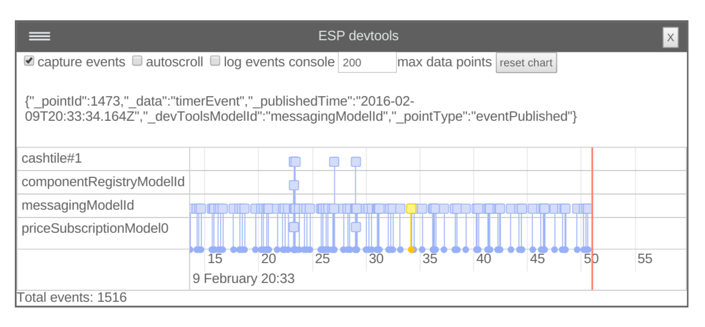

[](https://www.npmjs.com/package/esp-js-devtools)
[](https://gitter.im/esp/chat?utm_source=badge&utm_medium=badge&utm_campaign=pr-badge&utm_content=badge)

# Evented State Processor (ESP) Dev Tools

The esp-js devtools give you the ability to monitor activity of all models in all routers.

Features:
* A real-time view of events and errors as they are processed by your models.
* Ability to zoom to the nth degree.
* Ability to log the entire event to the browsers console.
* Can be opened and closed (it's currently implemented as a floating div).



# Installation
Install from npm: `npm install --save esp-js-devtools`.

Wire it up early on in your app:

```
import espDevTools from 'esp-js-devtools';
espDevTools.registerDevTools();
```

# Activation 

It's activate using a keyboard shortcut: `ctrl + alt + d`. 

#  Demo

For a demo check out the esp port of the [react chat app](https://github.com/esp/esp-js/tree/master/examples/esp-chat-react-es6).

# ESP Documentation

[http://esp.readthedocs.org](http://esp.readthedocs.org).

# Licence 

Apache 2